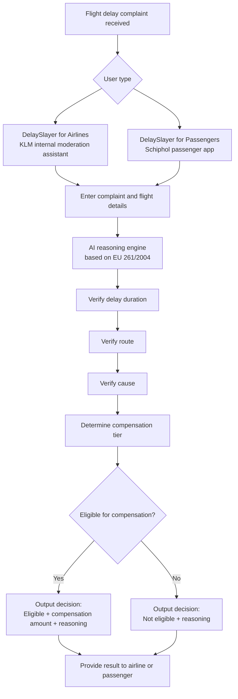

```mermaid
flowchart TD
   A[Flight delay complaint received] --> B{User type}


   B --> C[DelaySlayer for Airlines<br/>KLM internal moderation assistant]
   B --> D[DelaySlayer for Passengers<br/>Schiphol passenger app]


   C --> E[Enter complaint and flight details]
   D --> E


   E --> F[AI reasoning engine<br/>based on EU 261/2004]


   F --> G[Verify delay duration]
   G --> H[Verify route]
   H --> I[Verify cause]
   I --> J[Determine compensation tier]


   J --> K{Eligible for compensation?}


   K -->|Yes| L[Output decision:<br/>Eligible + compensation amount + reasoning]
   K -->|No| M[Output decision:<br/>Not eligible + reasoning]


   L --> N[Provide result to airline or passenger]
   M --> N
```
